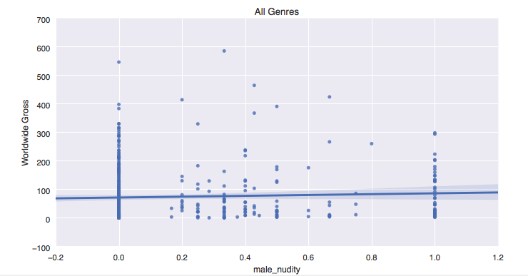
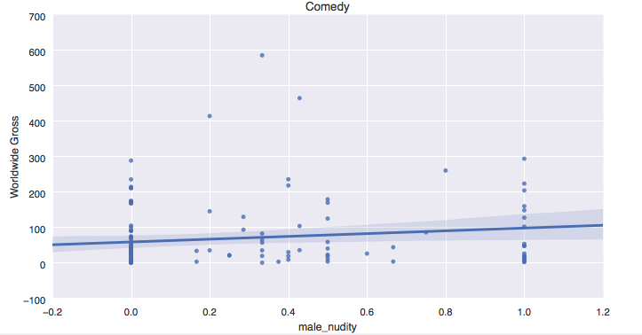
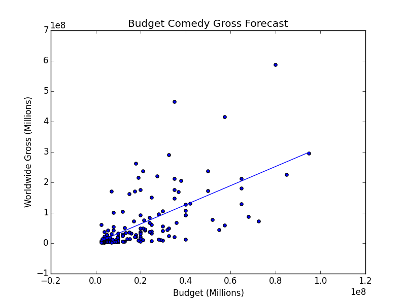

**QUESTION:** 
Does the proportion of male nudity to all nudity have an impact on film popularity? 
I.e. is a rated R film with a bunch of man flesh going to bomb compared to other films with female nudity/no nudity? 

* 1.0 = only male nudity
* 0.5 = equal male/female nudity
* 0.0 = only female nudity/no nudity 

It appears a high proportion of male nudity is not associated with lower worldwide gross or popularity. 

This plot of comedies suggests the opposite of my hypothesis, that  more male nudity is correlated with higher gross.    

However, when we use linear regression to forecast gross with a test set, a movie budget model alone is better at forecasting gross than a model that was trained with both budget and the male nudity parameter. 

**CONCLUSION:** 
Rated R viewers are generally chill with naked dudes.   

**Dataset**

Nudity levels were determined using occurrence of related keywords posted to a film on IMDB. Bias inherent to the IMDB community tagging the films will be reflected in the results. 

The data set is comprised of movies from the Box Office Mojo, IMDB, and Metacritic websites that meet the following criteria:

- Rated R (not interest in advocating nudity for films intended for those under 17)
- Production budget available and above $10mm (interested in presenting these results to real studios)
- Released between 2005 and 2014 (older thoughts and preferences about nudity are likely not to be as relevant)
- Main language is English (captures movies that were created with the US audience in mind)

 
    
