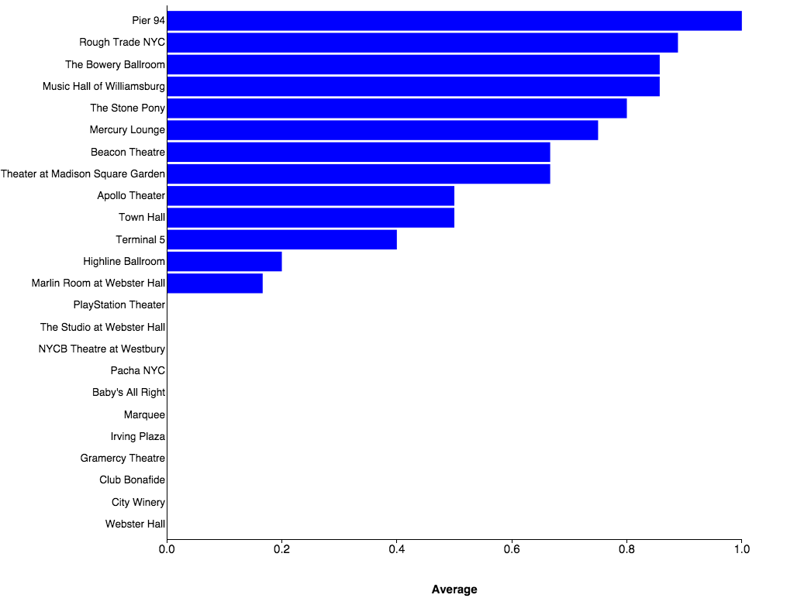
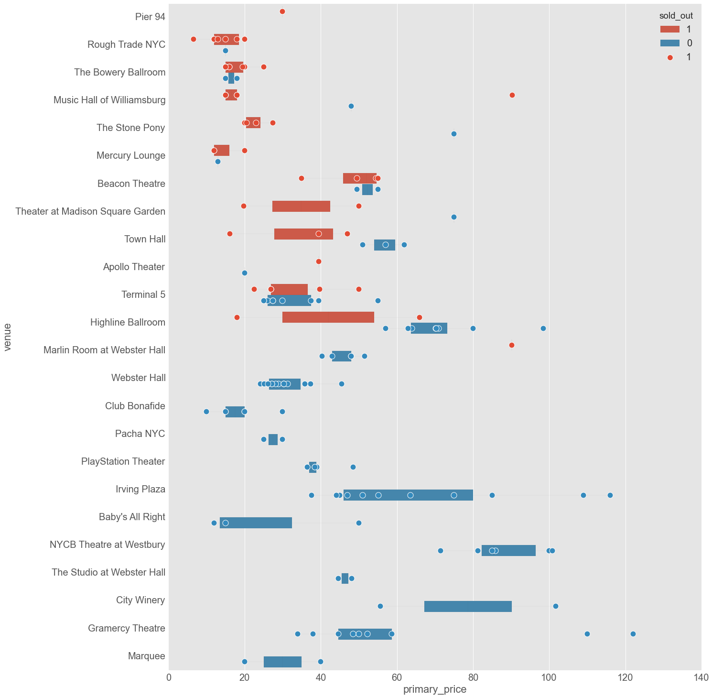
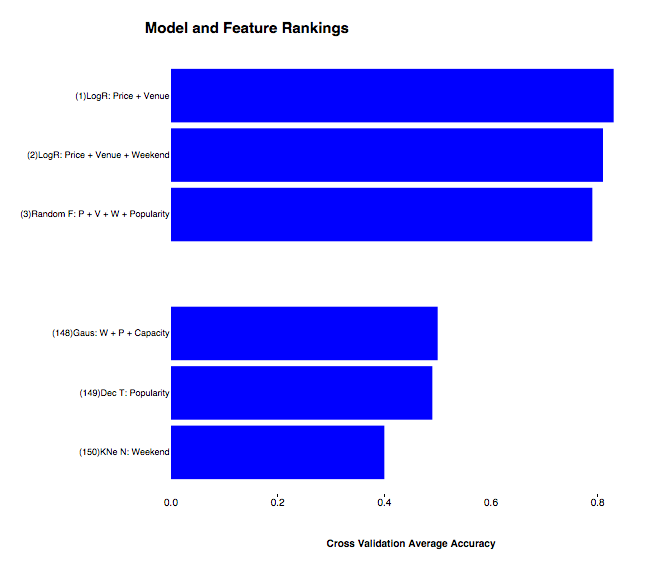
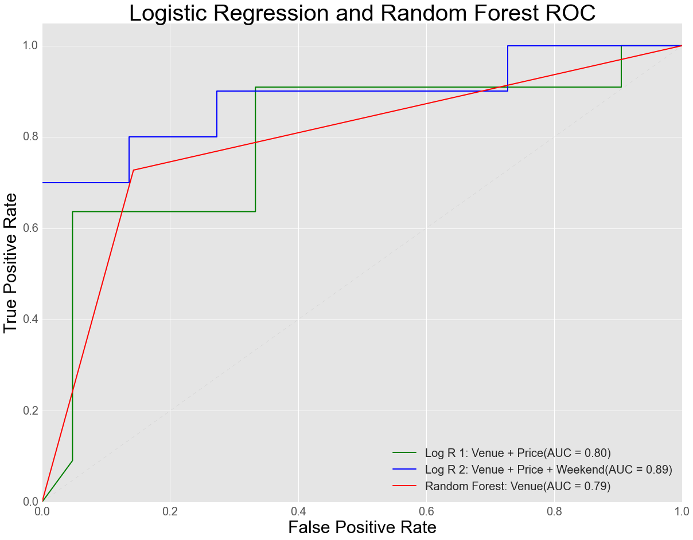

An attempt to predict whether specific concerts will sell out in NYC. 

Features Investigated:
* Event Ticket Price 
* Artist Popularity (Songkick following)
* Location (Lon/Lat)
* Weekend/Weekday
* Event Capacity
* 27 Unique NYC/Brooklyn Venues(Categorical)

Key takeaway is that, at least for the time frame investigated (fall 2015), the most powerful predictor was the particular venue. It appears there is much more at work than popularity vs. venue size. I suspect it has a lot to do with how the revenue generated from ticket sales and bar sales are distributed between the artist and venue. Venues seeking to maximize bar sales are likely in the business of selling out as much as possible. 

The below graph ranks venues by the percentage of shows that were sold out during the investigated time frame. 

Price was another important factor and it is intuitive that the venues that tended to sell out had lower ticket prices. 

Due to the relative small size of my data set I was able to test many machine learning models and feature spaces. As you can see below the best performer was the logistic regression classifier using only the 27 venues and price as features. 

Further details of the superior performance of this model and feature space are detailed by the ROC curves below. 

Bonus:

