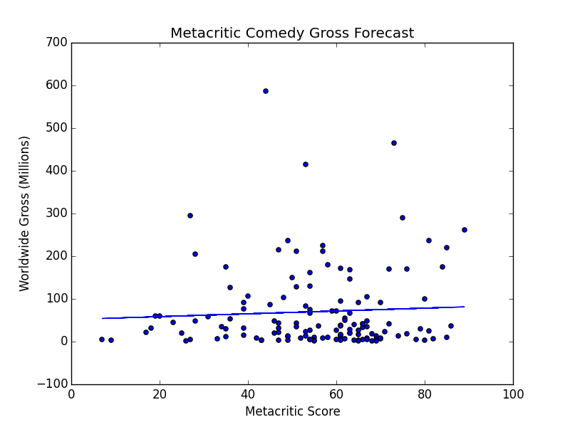

***[Enter the Void - this has nothing to do with anything, but it's an awesome movie poster](http://www.imdb.com/title/tt1191111/)***

***THIS IS A DRAFT**
**Scenario:**

Kevin Bacon wants to back up his nudity argument to studios with data. They keep telling him he doesn't need to whip it out, but his message: whip it out for the social good and profit! The basic premise: - the more male nudity the better. If you prefer the horse's mouth: 
[Bacon on Male Nudity](https://www.youtube.com/watch?v=3Dt3IrdampY)

This is a journal of Bacon's efforts. 

**Analysis In Progress**

The data set is comprised of movies from the Box Office Mojo, IMDB, and Metacritic websites that meet the following criteria:

- Rated R (not interest in advocating nudity for films intended for those under 17)
- Production budget available and above $10mm (interested in presenting these results to real studios)
- Released between 2005 and 2014 (older thoughts and preferences about nudity are likely not to be as relevant)
- Main language is English (captures movies that were created with the US audience in mind)

First let's see how more nudity impacts the median movie gross for out data set.

Does not seem to mean much here. 

Next let's zoom in on comedies, since we assume people are generally more comfortable with nudity in that context. 

Looks like there is some sort of relationship. Let's investigate further by looking at the actual data points.  

BE CAREFUL! Should we come out and say the 3 points over 400 million are all outlines and ignore them, or keep them and preserve the relationship? I'm going to keep them for now, but ***I still need to quantify these outliers from a stats approach***!!!

Let's see how a linear regression looks:

Definitely looks like those high points at 5,6 and 7 are really contributing to the angle here. Let's ignore it for now and consider other predictors.

1. The production budget (proxy for total resources behind the movie)
2. Metacritic score (proxy for quality). 

Let's see how well each works by itself. 

It seems production budget is a more useful predictor on its own than Metacritic rating.  

Once we feed these features into a best fit model we find out the following:

**Scores**
- Metacritic/budget training score 0.434422310815

- nudity level added score **0.473791747823**

- Metacritic/budget test score **0.267712588339** 

- nudity level added test score 0.264120598801

**Coef**

Model without nudity, coeffecients: 
- Metacritic: 924,054.62
- Production Budget: 3.30

Mode with nudity, coeffeceints:
- Nudity score: 9,072,286.09   
- Metacritic: 1,055,352.19
- Production Budget: 3.10

Based on the linear regression performed each incremental Metacritic point is worth $1mm in gross, each production dollar invested is worth $3 in gross, and each incremental 

Concerned about colinearity between nudity score and metacritic - no covariance. 
df['nudity_score'].corr(df['metacritic2'])

-0.042259057148950237

For comedies it looks like more nudity is associated with very slightly lower scores, but it doesn't seem colinearity between the two is plauging the model. 

This means that while nudity score seemed to help increase fit in the training set it actually reduced the model's ability to forecast gross in the test set. 

**Next Step**

The level of nudity, as measured by instances of tagged keywords associated with nudity on IMDB, does not seem to be a useful predictor of gross. 

But perhaps we shouldn't give up on Bacon just yet. Let's improve the nudity score by normalizing it on a per movie basis. That is let's re-scrape the data taking into account the total number of keywords. Let's also separate female nudity and male nudity to the extent we can. 

 

 
    