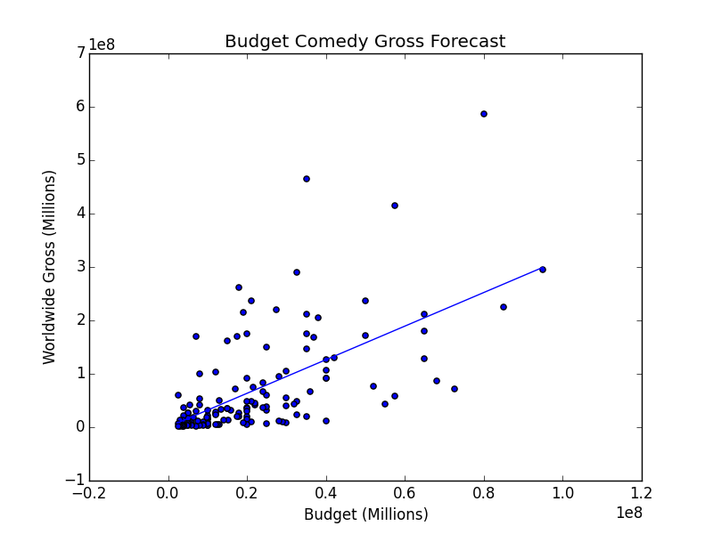

***[Enter the Void](http://www.imdb.com/title/tt1191111/)***

    
        hack hack hack
    

**Scenario:**

Kevin Bacon wants to set a progressive example in his roles.
http://www.vanityfair.com/hollywood/2015/08/kevin-bacon-male-full-frontal-nudity

In Bacon's upcoming film, “Wild and Loose”, the studio, which get to determine the final cut, is against including Bacon’s full frontal despite the social remafications. Bacon is so determined that he meets the greedy bastards on their terms and offers his entire salary of $[2]mm.

Studio management concludes they are now responsible for including and analyzing the “male nudity” feature in their total gross forecast model.

**Description of data sources:**

- Box office mojo for movie gross and basics (MPAA,Genre,budget)
- Metacritic for critic ratings
- I intend to parse the IMDB parental section on each movie for instances of words/phrases related to male nudity.

**Features to control:**

- Production Budget
- MPAA Rating
- Critic ratings
- Nudity Yes/No

**Analysis In Progress**

Nudity Analysis: Median Gross for all genres in dataset

Does not seem to mean much here. 

Nudity Analysis: Median Gross for comedies in dataset

Looks to be a relationship here!

Let's take a look at the spread

Let's see how a forecast looks:

mehhh not grea. But maybe this can be a helpful feature on top of others. 

Key forecaster 1: Budget

Key forecaster 2: Quality (Metacritic Score)

Once we feed these features into a best fit model we find out the following:

-metacritic/budget training score 0.434422310815

-nudity level added score **0.473791747823**

-metacritic/budget test score **0.267712588339** 

-nudity level added test score 0.264120598801

This means that while nudity score seemed to help increase fit in the training set it actually reduced the model's ability to forecast gross in the test set. 

 

 
    