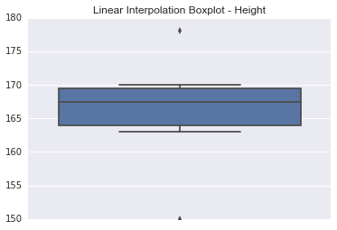
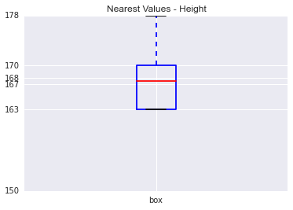
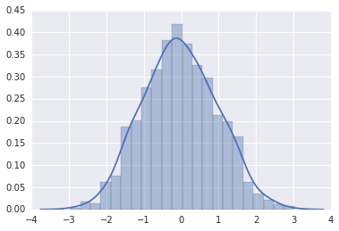
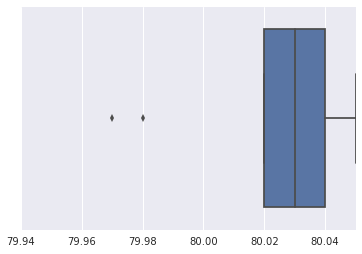
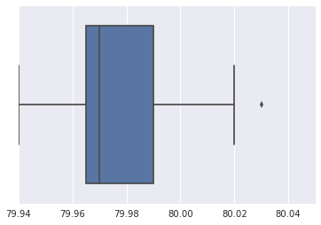
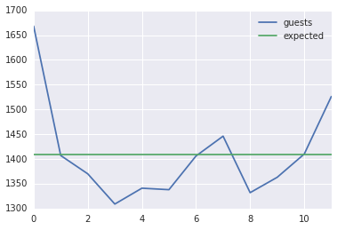
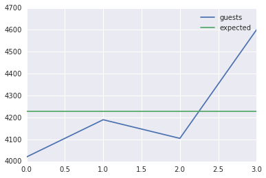
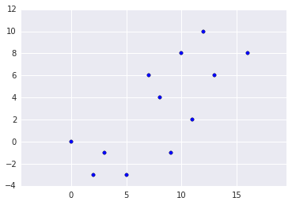
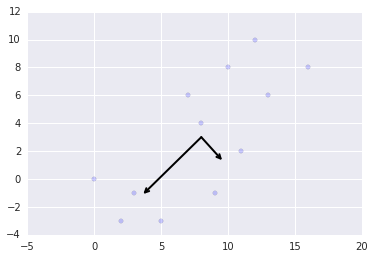

**John Winter Data Challenge**

    import math
    import pandas as pd
    import numpy as np
    import matplotlib.pyplot as plt
    import seaborn
    import scipy
    from sklearn.decomposition import PCA
    
    
    %matplotlib inline

**Question 1.a**

    height=np.array([150,163,167,168,170,178])

**By default numpy uses linear interpolation**

    print 'min',np.min(height)
    print '1st', np.percentile(height,25)
    print 'median',np.median(height)
    print '3rd',np.percentile(height,75)
    print 'max',np.max(height)

    min 150
    1st 164.0
    median 167.5
    3rd 169.5
    max 178

**We can also force numpy to use nearest values**

    print 'min',np.min(height)
    print '1st', np.percentile(height,25, interpolation='lower')
    print 'median',np.median(height)
    print '3rd',np.percentile(height,75, interpolation='higher')
    print 'max',np.max(height)

    min 150
    1st 163
    median 167.5
    3rd 170
    max 178

**Question 1.b**

    print 'mean',np.mean(height)

    mean 166.0

**Question 1.c**

    l_q75 = np.percentile(height,75)
    l_q25 = np.percentile(height,25)
    l_iqr = l_q75 - l_q25

    

    print 'Linear interpolation IQR',l_iqr

    Linear interpolation IQR 5.5

    q75 = np.percentile(height,75, interpolation='higher')
    q25 = np.percentile(height,25, interpolation='lower')
    iqr = q75 - q25

    print 'IQR',iqr

    IQR 7

**Question 1.d**

    l_q25-l_iqr*1.5

    155.75

    l_q75+l_iqr*1.5

    177.75

150 and 178 are both possible outliers based on the IQR 'fence' definition using linear interpolation

    q25-iqr*1.5

    152.5

    q75+iqr*1.5

    180.5

150 is a possible outlier based on the IQR 'fence' definition using nearest value

**Question 1.e**

    seaborn.boxplot(height,whis=1.5,vert='True')
    seaborn.plt.title('Linear Interpolation - Height')

    <matplotlib.text.Text at 0x113f7e8d0>

    item = {}
    
    item["label"] = 'box'
    
    item["med"] = 167.5
    item["q1"] = 163 
    item["q3"] = 170
    
    item["whislo"] = 163 
    item["whishi"] = 178 
    item["fliers"] = [] 
    
    stats = [item]
    
    fig, axes = plt.subplots(1, 1)
    axes.bxp(stats)
    axes.set_title('Nearest Values - Height')
    y_axis = [150,163,167,168,170,178]
    y_values = ['150','163','167','168','170','178']
    plt.yticks(y_axis, y_values)

    ([<matplotlib.axis.YTick at 0x113c13fd0>,
      <matplotlib.axis.YTick at 0x113c13b10>,
      <matplotlib.axis.YTick at 0x113ef8850>,
      <matplotlib.axis.YTick at 0x113f03250>,
      <matplotlib.axis.YTick at 0x113f039d0>,
      <matplotlib.axis.YTick at 0x113f0d190>],
     <a list of 6 Text yticklabel objects>)

**Question 1.f**

    print 'Variance',height.var()

    Variance 71.6666666667

    print "Standard Deviation", height.std()

    Standard Deviation 8.4656167328

**Question 2**

i. Metric,Interval/Discrete

ii. Non-metric, Ordinal

iii. Non-metric, Nominal/Categorical

iv. Possibly in between. Without more information would categorize Non-metric, Ordinal

V. Possible to argue it is in between. I would categorize Non-metric, Ordinal

**Question 3**

Shorthand used to remember the percentage of values that lie within a band around the mean in a normal distribution with a width of one, two and three standard deviations. 

**Question 4.a**

The 84th percentile. Using the rule above we can just do 50(mean)+68(1 std)/2 

**Question 4.b**

Approximately 27% of people. I used a standard normal distribution z-table.

    print 'z-score:',(90-100)/16.0

    z-score: -0.625

**Question 5**

Probability of Silver Given Silver=P(Find S/SC)/(P(Find S/SC)+P(Find S/GC)+P(Find S/MC))

P(S|S)=1/(1+0+.5)=1/1.5=2/3

**Question 6**

In order for the longer piece to be more than twice the length of the shorter piece, the line must be cut at below 1/3 the length or above 2/3. Therefore the probability is the union of these two or 2/3rds. 

**Question 7**

Probabilty of flu given positive test = (P(Positive test | given present)*P(Disease present in anyone))/(P(probability of anyone getting positive test result))

(P(B|A)*P(A))/(P(B))

Given:

P(A) = .1

P(B|~A) = .01

P(~B|A) = .03

Derived:
    
P(B|A) = 1-P(~B|A) =.9997

P(B) = P(B|A) x P(A) + P(B|~A) x P(~A) 

P(B) = .9997*.1 + .01*.9 =.109

P(B|A) = .9997*.1/.109 = .917

Probabilty of flu given positive test is approximately 92%

**Question 8**

The mu over the time period is 100. I calculate the probability of critical failures in all the cases other than 100+ (0-99) and subtract the sum probability from 1

    total=0
    for x in range(0,100):
        total+=scipy.stats.distributions.poisson.pmf(x, 100)
       
    print 'probability:', 1-total
        

    probability: 0.513298798279

51% probability of 100 or more critical failures over the next 50 years. 

**Question 9.a**

    SE = STD/sqrt(n)

    
    .8/math.sqrt(100) 

    0.08

    **Question 9.b**

Assuming a normal distribution we use the z table to find the corresponding number of standard deviations. 

The 95% confidence interval is composed of the following:

Lower = 1.6-.08*1.96 = 1.443

Upper = 1.6+.08*1.96 = 1.757

**Question 9.c**

U = Umbrellas/Apartment * Apartments

U = 12,800

**Question 9.d**

SE = STD/sqrt(n)

    .8*8000/math.sqrt(100)

    640.0

**Question 9.d**

Assuming a normal distribution we use the z table to find the corresponding number of standard deviations.

The 95% confidence interval is composed of the following:

Lower = 12,800-640*1.96 = 11,545.6

Upper = 12,800+640*1.96  = 14,054.4

**Question 10**

First I randomly sample from a normal distribution using numpy then count all values within the interval [0,1]

    random_normal=np.random.normal(size=1000)

    seaborn.distplot(random_normal)

    <matplotlib.axes._subplots.AxesSubplot at 0x113d60e90>

    within=((0 < x) & (x < 1)).sum()

    within/1000.0

    0.33300000000000002

33.3% of the randomly generated values were in the interval [0,1]

**Question 11**

There is not enough information available to determine if the promotion was effective. 
The month to month variance may be such that 350 is a typical occurance, and so the observation would have nothing to do with the promotion.  

**Question 12**

To answer this question I used a ttest to find whether the samples were drawn from the same population. If they are drawn from the same population then the p-value will be large, which suggests it would be likey to randomly draw these samples from the same population.

    t,p_value=scipy.stats.ttest_ind([79.98,80.04,80.02,80.04,80.03,80.03,80.04,79.97,80.05,80.03,80.02],[80.02,79.94,79.98,79.97,79.97,80.03,79.95,79.97])

    p_value

    0.0035356633089528265

    1-p

    0.99646433669104717

This p_value is quite small. It is outside a 99% confidence interval so we would reject the null hypothesis and say that the results from the two methods differ.

As a check I plot the two data sets and see for myself that distributions do in fact look significantly different. 

    data={'a':[79.98,80.04,80.02,80.04,80.03,80.03,80.04,79.97,80.05,80.03,80.02],'b':[80.02,79.94,79.98,79.97,79.97,80.03,79.95,79.97]}

    ax=seaborn.boxplot(data['a'])
    ax.set_xlim([79.94,80.05])

    (79.94, 80.05)

    ax=seaborn.boxplot(data['b'])
    ax.set_xlim([79.94,80.05])

    (79.94, 80.05)

    **Question 13**

First perform chisquared test. Also will look at  a a visual check.

    air=pd.DataFrame(['Jan','Feb','Mar','Apr','May','Jun','Jul','Aug','Sep','Oct','Nov','Dec'],[1668,1407,1370,1309,1341,1338,1406,1446,1332,1363,1410,1526])
    air=air.reset_index()
    air.columns=['guests','month']
    air['expected']=[sum(air['guests'])/12]*12
    scipy.stats.chisquare(air['guests'],air['expected'])

    Power_divergenceResult(statistic=79.051809794180272, pvalue=2.2502167472646262e-12)

The low p-value indicates that it is extremely unlikey that the bookings are uniformly distributed. It is possible that there is a season pattern.  

    air.plot()

    <matplotlib.axes._subplots.AxesSubplot at 0x116c42310>

    air_season=pd.DataFrame(['Spring','Summer','Fall','Winter'],[(1370+1309+1341),(1338+1406+1446),(1332+1363+1410),(1526+1668+1407)])
    air_season=air_season.reset_index()
    air_season.columns=['guests','month']
    air_season['expected']=[sum(air_season['guests'])/4]*4
    air_season.plot()

    <matplotlib.axes._subplots.AxesSubplot at 0x117a8aed0>

The visuals reinforce the evidence that the bookings are not uniformly distributed. 

    x=np.dot([[2,3],[2,1]],[[3],[2]])

    x=np.dot([[3,0,1],[-4,1,2],[-6,0,-2]],[[-1],[1],[3]])

    x

    array([[ 0],
           [11],
           [ 0]])

    x/4

    array([[3],
           [2]])

**Question 14.a**

    q14=pd.DataFrame([16,12,13,11,10,9,8,7,5,3,2,0],[8,10,6,2,8,-1,4,6,-3,-1,-3,0])
    q14=q14.reset_index()
    q14.columns=['x2','x1']

    np.corrcoef(q14['x1'],q14['x2'])

    array([[ 1.       ,  0.7456203],
           [ 0.7456203,  1.       ]])

    plt.scatter(q14['x1'],q14['x2'])
    plt.axis('equal');

The correlation of X1 and X2 is .74 and PCA will provide information about the nature of the linear relationship. If the question is to whether we can use PCA to cut out data and only retain the component with the highest variance I would lean towards no, but it is difficult to say without background information on the data and the desired use.   

**Question 14.b**

    X=np.column_stack((q14['x1'],q14['x2']))

    pca = PCA(n_components=2)

    pca.fit(X)

    PCA(copy=True, n_components=2, whiten=False)

    pca.get_covariance() #Uses n vs. n-1

    array([[ 21.16666667,  15.08333333],
           [ 15.08333333,  19.33333333]])

    print(pca.components_) #Eigenvectors  

    [[-0.72823813 -0.68532417]
     [ 0.68532417 -0.72823813]]

    **Question 14.c**

    print(pca.explained_variance_) #Eigenvalues, variance

    [ 35.36116217   5.13883783]

    def draw_vector(v0, v1, ax=None):
        ax = ax or plt.gca()
        arrowprops=dict(arrowstyle='->',linewidth=2,shrinkA=0, shrinkB=0)
        ax.annotate('', v1, v0, arrowprops=arrowprops)
    # plot data
    plt.scatter(q14['x1'],q14['x2'], alpha=0.2)
    for length, vector in zip(pca.explained_variance_, pca.components_):
        v = vector * 1 * np.sqrt(length)
        draw_vector(pca.mean_, pca.mean_ + v)

    **Question 14.d**

    print(pca.explained_variance_ratio_)

    [ 0.87311512  0.12688488]

More than 87% of the variability is explained by a single component. 
